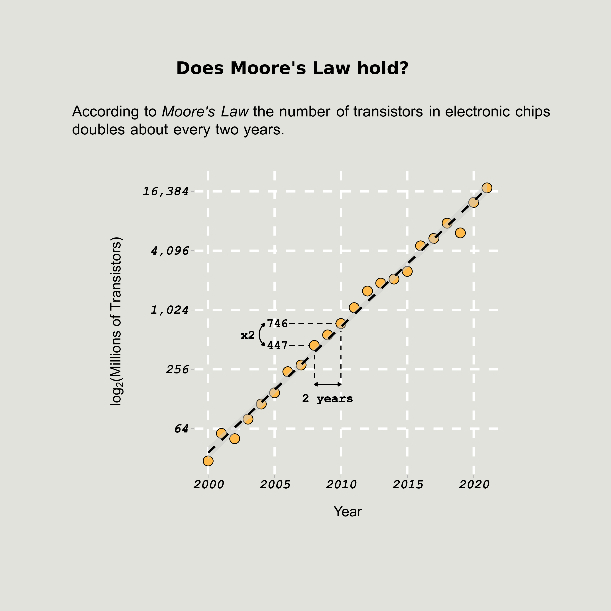

# My `TidyTuesdays` data viz

Here are my data visualizations shared in this R community initiative.

## Gallery
Click on the images to view their code!

    <table width="100%" bgcolor="red" border="0">
        <thead>
            <tr>
                <th>
                    2022-08-30 | <a href="">??? Dataset</a>
                </th>
                <th>
                    2022-08-23 | <a href="https://chip-dataset.vercel.app/">Chips Dataset</a>
                 </th>
            </tr>
        </thead>
        <tbody>
          <tr>
              <td width="50%">
                <a href="" title="See Code">
                    

                        
                    

                </a>
              </td>
              <td width="50%">
                <a href="https://github.com/MiqG/tidytuesday/blob/master/scripts/2022-08-23-chips.R" title="See Code">
                    

                        
                    

                </a>
              </td>
          </tr>
        </tbody>
    </table>

